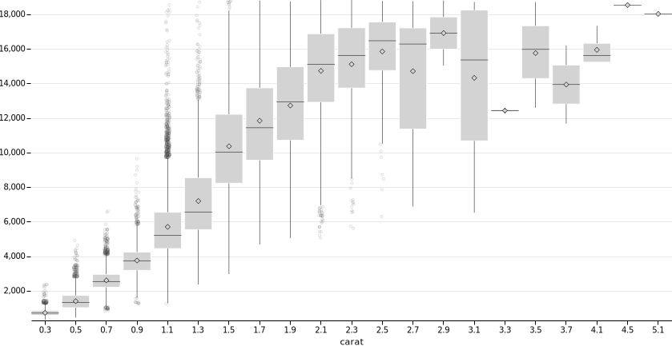
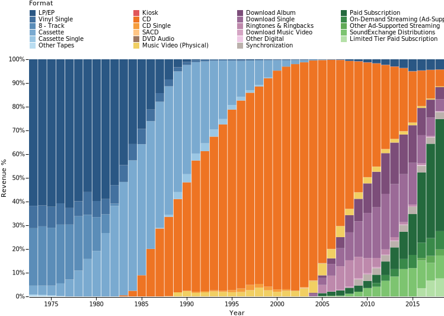
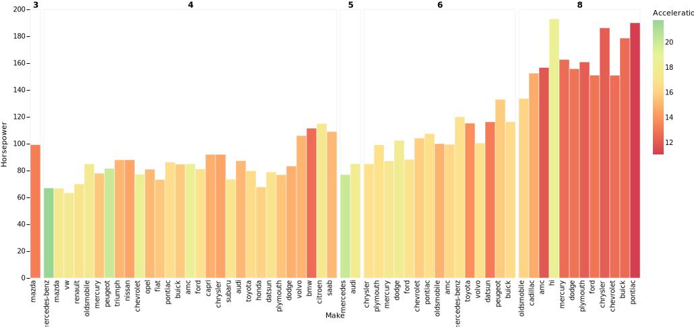
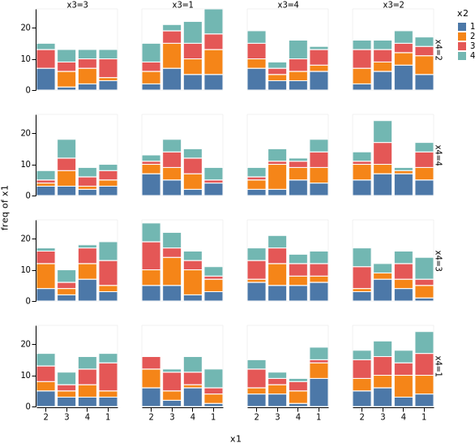

# StatisticalGraphics

The idea of the `StatisticalGraphics` package is to create a powerful, yet easy-to-use solution for creating statistical graphics. 
The package uses [`vega`](https://vega.github.io/vega/) (see also [D3](https://d3js.org/)) for producing the final outputs.

# Examples

```julia
julia> using StatisticalGraphics
julia> using InMemoryDatasets
julia> ds = Dataset(x=1:100, y=rand(100), y2=rand(100) .+ 5, group=rand(1:2, 100));
julia> sgplot(ds, [
                    Line(x=:x, y=:y2, y2axis=true, group=:group),
                    Scatter(x=:x, y=:y2, group=:group)
                  ],
                  nominal = [:group],
                  xaxis = Axis(grid=true),
                  yaxis = Axis(grid=true))
```


```julia
julia> ds = Dataset(x=randn(10^7));
julia> sgplot(ds, Histogram(x=:x, color=:steelblue, outlinethickness=0.5, space=0.5),
                  xaxis = Axis(offset=10, domain=false),
                  yaxis = Axis(offset=10, domain=false, grid=true)
               )
```


**Dubai Weather**

```julia
julia> using DLMReader
julia> dubai_weather = filereader("assets/dubai_weather.csv", types=Dict(1 => Date))
julia> sgplot(dubai_weather, [
        Band(x=:date, lower=:min, upper=:max),
        Line(x=:date, y=:min, color="#4682b4", thickness=1),
        Line(x=:date, y=:max, color="#ff7f0e", thickness=0.5),
        Line(x=:date, y=:pressure, color="#2ca02c", y2axis=true, breaks=true),
        Scatter(x=:date, y=:pressure, color="#2ca02c", size=10, y2axis=true)
    ],
    xaxis=Axis(offset=10, type=:date, grid=true, griddash=[1, 1], title="Date"),
    yaxis=Axis(offset=10, grid=true, griddash=[1, 1], title="Temperature(°C)"),
    y2axis=Axis(offset=10, title="Pressure"))
```


Using `BoxPlot` to plot monthly temperature (minimum and maximum), and add second axes for plotting weekly pressure.

```julia
julia> modify!(dubai_weather, :date=>byrow(week)=>:Week)
julia> setformat!(dubai_weather, :date=>month)

julia> sgplot(dubai_weather, [
    BoxPlot(y=[:min, :max], category=:date, outliers=true),
    BoxPlot(y=:pressure, category=:Week, opacity=0.5, y2axis=true, outliers=true, x2axis=true)
  ],
  xaxis=Axis(title="Month"),
  yaxis=Axis(title="Temperature"),
  y2axis=Axis(title="Pressure", d3format="f"),
  x2axis=Axis(values=[1; 10:10:50]),
  height=600
)
```


**[Box Plot](https://observablehq.com/@d3/box-plot)**

Using the `format` feature of `InMemoryDataset` to manually bin data before plotting a box plot.

```julia
julia> diamond = filereader("assets/diamonds.csv")
julia> carat_fmt(x) = round((searchsortedfirst(0.19:0.2:5.02, x)-2)*.2 + 0.3, digits=2)
julia> setformat!(diamond, :carat=>carat_fmt)

julia> sgplot(diamond, 
                      BoxPlot(y=:price, category =:carat,
                              mediancolor=:black, medianthickness = 0.5,
                              fencewidth=0,
                              whiskerdash=[0], whiskerthickness = 0.5,
                              outliers = true,
                              outlierjitter = 5, outliersymbolsize=10, outliercolor=:black, outlieropacity=0.1
                            ),
                              yaxis=Axis(domain = false, nice=false, grid=true),
                              groupcolormodel=["lightgray"],
                              legend=false,
                              width=800)
```



**Bar chart**

```julia
julia> bar_ds = Dataset(x = repeat(1:50, outer=50), group = repeat(1:50, inner = 50))
julia> insertcols!(bar_ds, :y => rand(nrow(bar_ds)))
julia> sgplot(bar_ds, Bar(x=2, response=3, group=1), # refer columns by their index
                        groupcolormodel = Dict(:scheme=>"turbo"),
                        xaxis=Axis(show=false),
                        yaxis=Axis(show=false),
                        legend = false)
```


**unemployment stacked area plot across industries** 


```julia
julia> unemployment = filereader("assets/unemployment_across_industry.csv", types = Dict(2=>Date))
julia> sort!(unemployment, :series, rev=true) # keep alphabetical order
julia> modify!(groupby(unemployment, :date), :count=>cumsum=>:cum_sum)
julia> sort!(unemployment, [:date,:cum_sum], rev=[false,true]) # put the larger area at the back

julia> sgplot(unemployment, Band(x=:date, lower=0.0, upper=:cum_sum, group=:series, opacity=1),
                            nominal = [:series],
                            xaxis=Axis(type=:time, nice=false),
                            yaxis=Axis(title=""),
                            groupcolormodel = Dict(:scheme=>"category20b"),
                            )
```


**[Revenue by Music Format, 1973–2018](https://observablehq.com/@mbostock/revenue-by-music-format-1973-2018)**

```julia
julia> music = filereader("assets/music.csv")
julia> color_ds = filereader("assets/color_ds.csv")
julia> leftjoin!(music, color_ds, on = :Format)# sort data based on d3js example
julia> sort!(music, [:Year, :order], rev = [false, true]) # rev = true for :order to make the color similar to d3js example

julia> inbillion(x) = x/10^9 # make the yaxis values in billion $
julia> setformat!(music, r"Infla" => inbillion)

julia> sgplot(music, [
                Bar(x = :Year, response = r"Infla", group = :Format, grouporder = :data, legend = :music_leg, outlinethickness = 0, space = 0.05)
              ],
              nominal = [:Format],
              groupcolormodel = reverse!(color_ds[:, :Color]),
              yaxis = Axis(title = "Revenue (billion, adj.)", domain = false),
              xaxis = Axis(values = 1975:5:2015),
              legend = Legend(name = :music_leg, rowspace=0, gridalign = :all, columns = 4, orient = :top, values = color_ds[:, :Format]),
              width = 700
              )
```


**Normalised bar chart**

```julia
julia> sgplot(music, [
        Bar(x=:Year, response=r"Infla", group=:Format, grouporder=:data, legend=:music_leg, outlinethickness=0, space=0.05,
        normalize=true)
    ],
    nominal=[:Format],
    groupcolormodel=reverse!(color_ds[:, :Color]),
    yaxis=Axis(title="Revenue %", domain=false, nice=false, d3format = "%"),
    xaxis=Axis(values=1975:5:2015),
    legend=Legend(name=:music_leg, rowspace=0, gridalign=:all, columns=4, orient=:top, values=color_ds[:, :Format]),
    width=700
)
```



**[Stacked Bar Chart, Diverging](https://observablehq.com/@d3/diverging-stacked-bar-chart)**

Using the `baselineresponse` keyword argument to control the baseline of bars in each category.

```julia
julia> ds = filereader("assets/politifact.csv")
julia> ds_order = Dataset(ruling = ["true", "mostly-true", "half-true","barely-true", "false", "full-flop", "pants-fire"], 
                  Ruling = ["True", "Mostly true", "Half true", "Mostly false", "False", "False", "Pants on fire!"],
                  order = 1:7,
                  weight = [0,0,0,-1,-1,-1,-1])
julia> leftjoin!(ds, ds_order, on = :ruling)
julia> sort!(ds, [:order], rev=true) # order Ruling
julia> modify!(groupby(ds, :speaker), 
              :count=> x->x ./ IMD.sum(x), # manually normalise counts
              [:count, :weight]=> byrow(prod) =>:baseline
              )

julia> sgplot(ds, [
                    Bar(y=:speaker, response=:count, group=:Ruling, grouporder=:data,
                        baselineresponse=:baseline, baselinestat=IMD.sum,
                        orderresponse=:baseline, orderstat=IMD.sum,
                        legend = :bar_leg,
                        x2axis=true,
                        outlinethickness=0.1
                      ),
                    RefLine(values = 0.0, axis=:x2axis)
                  ],
                  nominal=[:Ruling, :speaker],
                  x2axis=Axis(title = "← more lies · Truthiness · more truths →", domain = false, d3format="%", nice=false, grid=true),
                  yaxis=Axis(title = "", domain = false, ticks = false),
                  legend = Legend(name = :bar_leg, title = "", orient=:top, columns=0, size=200, columnspace = 10 ),
                  width=800,
                  height=200,
                  groupcolormodel=["#d53e4f", "#fc8d59", "#fee08b", "#e6f598", "#99d594", "#3288bd"]
              )
```


# Examples - sgpanel

**Cars example**

The following bar chart shows the average horsepower of different cars (bar categories) across different number of cylinders (panel). The color of each bar is computed based on the mean of acceleration inside each group of cars (bar categories) and the bars inside each panel are sorted by the maximum horsepower.

```julia
julia> cars = filereader("assets/cars.csv", types = Dict(9=>Date))
julia> make_fmt(x) = split(x)[1]
julia> setformat!(cars, :Name => make_fmt)
julia> sgplot(groupby(cars, :Cylinders), 
                     Bar(response=:Horsepower, x=:Name, stat=IMD.mean,
                          colorresponse=:Acceleration, colorstat=IMD.mean,
                          outlinethickness=0.5, space=0,
                          orderresponse=:Horsepower, orderstat=IMD.maximum,
                          colormodel=["#d53e4f", "#fc8d59", "#fee08b", "#e6f598", "#99d594"]
                        ),
                     nominal = [:Cylinders],
                     layout = :row,
                     linkaxis=:y,
                     proportional=true,
                     stepsize=15,
                     xaxis=Axis(title="Make", angle=-90, baseline=:center, align=:right, ticksize=0, domain=false),
                     yaxis=Axis(title="Horsepower", domain=false),
                     columnspace = 5
              )
```



**usage**

```julia
julia> panel_example = Dataset(rand(1:4, 1000, 10), :auto)
julia> sgplot(gatherby(panel_example, [:x3, :x4]), 
                        Bar(x=:x1, group=:x2),
                        nominal = [:x2],
                        layout = :lattice,
                        width = 100,
                        height = 100
              )
```



